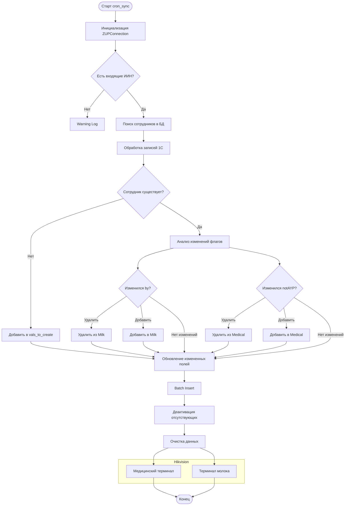

# Я опишу, как это используется в Odoo. Логику как это работает

В базу данных Odoo в таблицу сотрудники, сохраняются активные сотрудники, код благодаря которому мы берем активных людей лежит в файле ZUPmain.py. Так как сотрутдинки то увольняются, то приходят опять. Это нужно синхронизовать. По этому каждый 24 часа идет синхронизация. И для оптимизации. Я обновляю только тех сотрудников, которые изменились, добавились. Для этого беру людей с posrgre и сравниваю с теми кто пришел.
Да это тоже не самый хороший подход брать всех людей и сравнивать, с людьми которые пришли с 1С. Возможно подойдет слайдинг виндоу, когда берем по 30 к примеру, и сравниваем с ними. После еще берем, следуищих 30.
После так же человек может быть АУП, и ВУ. И меняться. По этому мы сохраняли его фото. Если человек
1. Был ВУ И АУП, но после синхронизации. Стал просто ВУ. То нужено удалить его с терминала ВУ.
2. Был ВУ, но после синхронизации. СТал АУП. НУжно удалить на терминале ВУ и добавить на терминал АУП.
3. Так же и наоборот был АУП. СТал ВУ.

Ну и так же, для оптимизации. Коплю все изменения. На удаления. На добавление. Удаления. И за 1 раз добавили/обновили.

Если человек уже не активный. Нужно удалить его с терминала. Его фото с сервера. Очистить поля в базе данных его айди карты, и путь где лежит фото.

# ВУ

У меня реализовано добавление на терминал ВУ, только в том случае, если сотрудник является вредным производством. '"by": true' в противном случае, он не добавится. При записи его ФИО или ИИН. Дополнительные данные ФИО или ИИН сами вводятся. И после сначала проверяются на коореткность и фиксируются. При изменении каком то, фиксация сбрасывается и происходит добавление. Так же все ошибки связанные. Отправили запрос на АПИ. Но указали не тот IP ошибка выводится. Не считали лицо или карту. Выводится сообщение. Или нет соединение с устройством timeout сети к примеру. Тоже выводится сообщение.

# AYP

Так же реализовано.

# Баги

- Реализовал только брание данные с терминала лицо и карту (надо еще и чтобы оператор вручную писал айди карты и лицо загружал, метод когда вручную добавляется лицо фотка загружается уже имеется)
- Если случайно у сущетсвующего человека, стали добавлять/обновлять его, то у него удаляются карты. Сделал так потому что реализовано чтобы лицо бралось с терминала, и это временная сслыка, и думал что если сразу просить лицо и номер карты. Ссылка на лицо потухнет. И не добавлю его. Нужно это проверить, сколько ссылка на лицо активна времени. По этоу сначала добавлется человек после к нему карта, и уже лицо скачивается, и добавлется лицо. Знаю одно точно, после присвание лица через временную сслыка временная ссылка потухает. И все нельзя скачать. По этому я скачиваю.
- У меня была ошибка в выходных данных когда, у меня все значения были str, даже буливанные значения. Это плохо так как в postgre там где должны быть поля булианы. У меня строка. Возвращаемые данные я пофиксил. А в Odoo нет. Скажите ИИ она сделает, номральной ИИ Codex, Cloud.
- Может еще есть баги